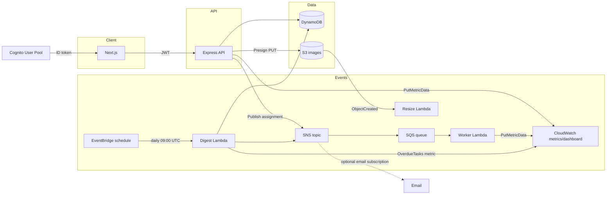

# Mini Jira (AWS Cloud Edition)

A production-style **Jira/Trello-lite** sample: **Next.js 15** frontend, **Express + TypeScript** API, **DynamoDB** persistence, **Cognito** JWT auth, and an **event-driven AWS** sidecar (S3, SNS→SQS, Lambdas, EventBridge, CloudWatch) deployed via **AWS CDK**.

## Repository layout

- `frontend/` — Next.js App Router UI (Tailwind + shadcn-style components, React Query, Axios, dnd-kit Kanban).
- `backend/` — Express API with Cognito JWT verification, Zod validation, DynamoDB data access, SNS publishing, S3 presigned uploads, CloudWatch custom metrics.
- `lambdas/` — Lambda function source consumed by CDK `NodejsFunction` bundling.
- `infra/cdk/` — CDK stack provisioning DynamoDB, Cognito, S3 (versioned), SNS topic + SQS subscription, Lambdas, EventBridge schedule, CloudWatch dashboard + alarm.

## Architecture (high level)



## Roles, teams, and authorization

- **Manager**: can read tasks across teams (implemented as DynamoDB **Scan** when no `teamId` filter is provided — acceptable for demos; at scale add a dedicated access pattern such as a GSI or team fan-out query).
- **Employee**: can only access tasks for `custom:teamId` from Cognito (enforced in the API via DynamoDB **Query** on `teamId-index`).

Backend middleware verifies Cognito **ID tokens** using `aws-jwt-verify` and attaches:

- `req.user.userId` (`sub`)
- `req.user.role` (`custom:role`)
- `req.user.teamId` (`custom:teamId`)

Local development fallback: if Cognito env vars are **not** set and `NODE_ENV !== production`, you can send:

`Authorization: Bearer <any>` **won’t work** — verifier requires pool. Instead use header:

`x-dev-user: {"userId":"u1","role":"employee","teamId":"team-alpha"}`

## Prerequisites

- Node.js **20+**
- AWS credentials configured (`aws configure` or environment variables) for deploy/seed
- Optional: Docker (only if you choose CDK bundling modes that require it; the defaults here bundle with esbuild)

## 1) Deploy infrastructure (CDK)

```bash
cd infra/cdk
npm install
npx cdk bootstrap aws://ACCOUNT/REGION   # once per account/region
npx cdk deploy
```

Copy the stack outputs into `backend/.env` and `frontend/.env.local`:

- `TasksTableName`, `CommentsTableName`, `ProjectsTableName`, `UsersTableName`
- `ImagesBucketName`
- `TaskTopicArn`
- `UserPoolId`, `UserPoolClientId`

### Email notifications (SNS)

The CDK stack wires **SNS → SQS → worker Lambda** for assignment events. For email, subscribe your inbox to the SNS topic once in the AWS console (recommended), or extend the CDK stack with `EmailSubscription`.

## 2) Cognito users (custom attributes)

Create users in the deployed pool and set mutable custom attributes:

- `custom:role` = `manager` or `employee`
- `custom:teamId` = e.g. `team-alpha` (employees must match task partition keys)

Enable **USER_PASSWORD_AUTH** / **ALLOW_USER_PASSWORD_AUTH** on the app client (CDK enables the auth flow).

## 3) Seed DynamoDB (sample data)

```bash
cd backend
cp .env.example .env
# fill in table names + region + optional SNS/S3
npm install
npm run seed
```

## 4) Run the API locally

```bash
cd backend
npm run dev
```

Health check: `GET http://localhost:4000/health`

## 5) Run the web app locally

```bash
cd frontend
cp .env.example .env.local
# set NEXT_PUBLIC_* values
npm install
npm run dev
```

Open `http://localhost:3000`.

## Important notes

- **Private S3 buckets** mean the `publicUrl` returned by the presigned upload helper may not be directly viewable in the browser without a **GET presigner**, **CloudFront**, or a bucket policy. The UI still stores the URL string; for real production, add `GET` presigning or CloudFront OAC.
- **Manager “all tasks”** without `teamId` uses DynamoDB **Scan** (documented tradeoff vs only having `teamId-index` + `assigneeId-index`).
- **S3 event → resize Lambda** skips keys under `tasks/thumbnails/` to avoid feedback loops.

## API routes (Express)

- `GET /health`
- `GET /tasks` (supports `teamId`, `assigneeId`, `cursor` for managers)
- `GET /tasks/:id`
- `POST /tasks`
- `PUT /tasks/:id`
- `DELETE /tasks/:id`
- `GET /tasks/:id/comments`
- `POST /tasks/:id/comments`
- `GET /tasks/:id/upload-url` (`contentType`, `extension` query params)
- `POST /tasks/:id/images` `{ "url": "..." }`
- `GET /projects`
- `POST /projects` (manager-only)

## Security checklist (production)

- Lock down CORS (`CORS_ORIGIN`) instead of `true`.
- Remove dev `x-dev-user` bypass (middleware) or guard it behind a dedicated env flag.
- Prefer **private API** + VPC interfaces / API Gateway + WAF depending on deployment target.
- Add **least-privilege IAM** policies for the API role (DynamoDB actions scoped to table ARNs, SNS publish scoped to topic ARN, S3 scoped to bucket/prefix).

## License

Educational sample — adapt as needed for coursework.
